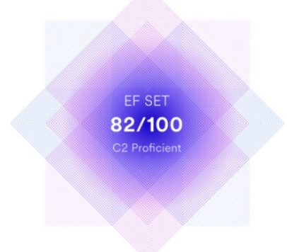

# Frontend Developer / _Stanislav Kudriavtsev_/

## Summary

&nbsp;&nbsp;&nbsp;&nbsp;I'm a "switcher" who has changed his life and field of activity for web-development.
Proficient in an assortment of technologies, including <em>JavaScript, React, Redux</em>.
Able to effectively self-manage during independent projects, as well as collaborate in a team setting.
Fan of <em>unit tests, functional programming</em> and <em>typed interfaces</em>.

  
More on my motivation and goals

Growing up as a millennial, I had a phone in my hands and was constantly engaged with the internet and social media, which significantly impacted my life. It opened up many possibilities I would not have had otherwise.

I experienced how the internet has been a disruptive innovation and a robust social equalizer. As a curious and grateful consumer, I am eventually <mark>becoming</mark> a creator myself. My professional goal is to make the web a better place for everyone, one page at a time!

## Contacts

|  |                     |
| :---------------------------------------: | :-------------------------------------------------------------------- |
|                            |                                                        |
|                 linkedIn                  | [stanislav-frontend](https://www.linkedin.com/in/stanislav-frontend/) |
|                   email                   | stas.webdev@yahoo.com                                                 |
|                  github                   | [stas-webdeveloper](https://github.com/stas-webdeveloper)             |
|                  discord                  | Stanislav (@stas-webdeveloper)                                        |

---

## Skills

<samp>

- ✓HTML5 & CSS3
- ✓JavaScript (>ES6) & TypeScript
- ✓React & Redux
- ✓NodeJS (basics)
- ✓Webpack
- ✓Git

</samp>

## Code Example

<pre>
  <code class="code">
    function finalGrade (exam, projects) {
        if(exam > 90 || projects > 10) return 100;
        if(exam > 75 & projects >= 5) return 90;
        if(exam > 50 & projects >= 2) return 75;
        return 0;
    }
  </code>
</pre>

---

## Experience

Freelance, Kaliningrad — Frontend Developer
_Jan 2019 - PRESENT_, https://mysite.com

- TASKS
  - Worked with honesty and integrity every step of the way.
  - Performed thorough research for planning purposes
  - Worked well independently
  - Fully engaged with team members to achieve the highest levels of productivity.
- ACCOMPLISHMENTS
  - Dramatically increased speed of UI development using atomic, scalable CSS
  - Improved accuracy, coverage, and speed of automated tests.

## Education

- Higher education
  - Highest Military Command Communication College, Location — Oryol, Russia
    _Aug 1984 - Aug 1988_
    Engineer for the operation of radio and electrical conductive communications
- Online learning
  - Glo Academy
    _Aug 2018 - Dec 2018_
    ✓ HTML/ CSS/ JS Basics

---

# Languages:

- :ru: Russian - native speaker
- :uk: English - B1/B2

[][efset]

**:heart: Hobbies:**

- Grandson
- Languages (JS, English, Spanish)
- Life as is...

[efset]: https://www.efset.org/cert/JS2U4M
